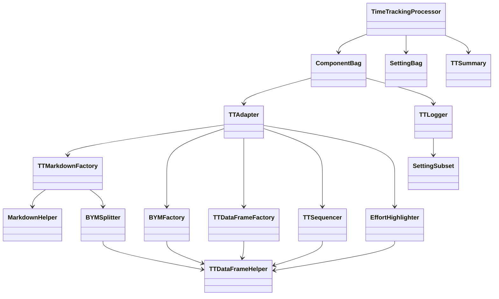

```mermaid
classDiagram
    %% Relationships
    TimeTrackingProcessor --> ComponentBag
    TimeTrackingProcessor --> SettingBag
    TimeTrackingProcessor --> TTSummary
    ComponentBag --> TTAdapter
    ComponentBag --> TTLogger
    TTLogger --> SettingSubset
    TTMarkdownFactory --> MarkdownHelper
    TTMarkdownFactory --> BYMSplitter

    BYMFactory --> TTDataFrameHelper
    BYMSplitter --> TTDataFrameHelper
    TTDataFrameFactory --> TTDataFrameHelper
    TTSequencer --> TTDataFrameHelper
    EffortHighlighter --> TTDataFrameHelper

    TTAdapter --> TTMarkdownFactory
    TTAdapter --> BYMFactory
    TTAdapter --> TTDataFrameFactory
    TTAdapter --> TTSequencer
    TTAdapter --> EffortHighlighter
```