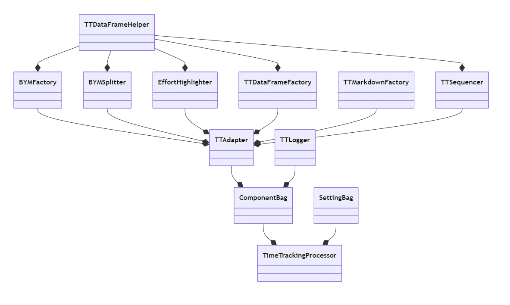
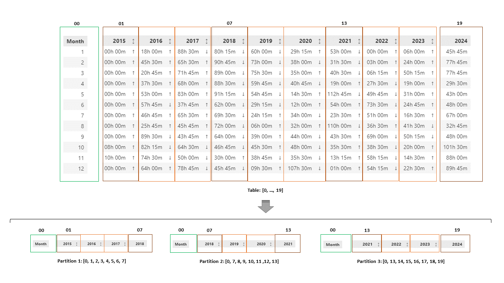

# nwtimetracking
Contact: numbworks@gmail.com

## Revision History

| Date | Author | Description |
|---|---|---|
| 2023-08-21 | numbworks | Created. |
| 2024-01-16 | numbworks | Updated to v1.3.0. |
| 2024-01-21 | numbworks | Updated to v2.0.0. |
| 2024-03-19 | numbworks | Updated to v3.0.0. |
| 2024-05-19 | numbworks | Updated to v3.2.0. |
| 2024-05-20 | numbworks | Updated to v3.3.0. |
| 2024-08-12 | numbworks | Updated to v3.4.0. |
| 2024-10-01 | numbworks | Updated to v3.7.0. |
| 2024-10-28 | numbworks | Updated to v3.8.0. |
| 2024-12-01 | numbworks | Updated to v3.9.0. |
| 2024-12-05 | numbworks | Updated to v4.0.0. |
| 2024-12-17 | numbworks | Updated to v4.5.0. |
| 2024-12-21 | numbworks | Updated to v4.6.0. |
| 2024-12-24 | numbworks | Updated to v4.7.0. |
| 2024-12-26 | numbworks | Updated to v4.8.0. |
| 2024-12-29 | numbworks | Updated to v5.0.0. |
| 2025-01-05 | numbworks | Updated to v5.0.1. |
| 2025-05-26 | numbworks | Updated to v5.0.2. |

## Introduction

`nwtimetracking` is an application designed to run automated data analysis tasks on `Time Tracking.xlsx`.

This file is the one I use to annotate the durations of all my sessions of extra work and continuos learning. This application is born to overcome the lack of support for durations (timedeltas) in Excel.

This project may not be useful for many (not generic enough), but I decided to upload it to `Github` anyway, in order to showcase my way of working when I face similar data analysis tasks and I decide to tackle them with `Python` and `Jupyter Notebook`.

## Getting Started

To run this application on Windows and Linux:

1. Download and install [Visual Studio Code](https://code.visualstudio.com/Download);
2. Download and install [Docker](https://www.docker.com/products/docker-desktop/);
3. Download and install [Git](https://git-scm.com/downloads);
4. Open your terminal application of choice and type the following commands:

    ```
    mkdir nwtimetracking
    cd nwtimetracking
    git clone https://github.com/numbworks/nwtimetracking.git
    ```

5. Launch Visual Studio Code and install the following extensions:

    - [Python](https://marketplace.visualstudio.com/items?itemName=ms-python.python)
    - [Pylance](https://marketplace.visualstudio.com/items?itemName=ms-python.vscode-pylance)
    - [Jupyter](https://marketplace.visualstudio.com/items?itemName=ms-toolsai.jupyter)
    - [Remote Development](https://marketplace.visualstudio.com/items?itemName=ms-vscode-remote.vscode-remote-extensionpack)
    - [Docker](https://marketplace.visualstudio.com/items?itemName=ms-azuretools.vscode-docker)

6. In order for the Jupyter Notebook to automatically detect changes in the underlying library, click on <ins>File</ins> > <ins>Preferences</ins> > <ins>Settings</ins> and change the following setting as below:

    ```
    "jupyter.runStartupCommands": [
        "%load_ext autoreload", "%autoreload 2"
    ]
    ```

7. In order for Pylance to perform type checking, set the `python.analysis.typeCheckingMode` setting to `basic`;
8. Click on <ins>File</ins> > <ins>Open folder</ins> > `nwtimetracking`;
9. Click on <ins>View</ins> > <ins>Command Palette</ins> and type:

    ```
    > Dev Container: Reopen in Container
    ```

10. Wait some minutes for the container defined in the <ins>.devcointainer</ins> folder to be built;
11. Open the notebook file (<ins>src/nwtimetracking.ipynb</ins>);
12. Edit the `SettingBag` object according to your needs;
13. Click on <ins>Run All</ins>;
14. Done!

Note: the mount point in `devcointainer.json` is meant to be used on Windows. If you are running VSCode on Linux, please change the current mount point with the following one:

```
"source=${localEnv:HOME}/Documents/nwtimetracking,target=/home/nwtimetracking/,type=bind,consistency=cached"
```

## Unit Tests

To run the unit tests in Visual Studio Code (while still connected to the Dev Container):

1. click on the <ins>Testing</ins> icon on the sidebar, right-click on <ins>tests</ins> > <ins>Run Test</ins>;
2. select the Python interpreter inside the Dev Container (if asked);
3. Done! 

To calculate the total unit test coverage in Visual Studio Code (while still connected to the Dev Container):

1. <ins>Terminal</ins> > <ins>New Terminal</ins>;
2. Run the following commands to get the total unit test coverage:

    ```
    cd tests
    coverage run -m unittest nwtimetrackingtests.py
    coverage report --omit=nwtimetrackingtests.py
    ```

3. Run the following commands to get the unit test coverage per class:

    ```
    cd tests
    coverage run -m unittest nwtimetrackingtests.py
    coverage html --omit=nwtimetrackingtests.py && sed -n '/<table class="index" data-sortable>/,/<\/table>/p' htmlcov/class_index.html | pandoc --from html --to plain && sleep 3 && rm -rf htmlcov
    ```

4. Done!

## Dependency Update

To check for the updatability of the dependencies this library is built upon, you can use the `nwpackageversions` library. Please:

1. Launch Visual Studio Code;
2. Click on <ins>File</ins> > <ins>Open folder</ins> > `nwtimetracking`;
3. <ins>Terminal</ins> > <ins>New Terminal</ins>;
4. Run the following commands to perform the dependency check (it requires an internet connection):

    ```
    cd src
    python3
    from nwpackageversions import RequirementChecker
    RequirementChecker().check("/workspaces/nwtimetracking/.devcontainer/Dockerfile")
    ```

5. You will get a log containing a list of up-to-date and out-of-date dependencies, that you can use to decide which update to perform.
6. Done!

## The makefile

This software package ships with a `makefile` that include all the pre-release verification actions:

1. Launch Visual Studio Code;
2. Click on <ins>File</ins> > <ins>Open folder</ins> > `nwtimetracking`;
3. <ins>Terminal</ins> > <ins>New Terminal</ins>;
4. Run the following commands:

    ```
    cd /workspaces/nwtimetracking/scripts
    make -f makefile <target_name>
    ```
5. Done!

The avalaible target names are:

| Target Name | Description |
|---|---|
| type-verbose | Runs a type verification task and logs everything. |
| coverage-verbose | Runs a unit test coverage calculation task and logs the % per class. |
| tryinstall-verbose | Simulates a "pip install" and logs everything. |
| compile-verbose | Runs "python -m py_compile" command against the module file. |
| compilenotebook-verbose | Runs "python -m py_compile" command against the notebook file. |
| unittest-verbose | Runs "python" command against the test files. |
| codemetrics-verbose | Runs a cyclomatic complexity analysis against all the nw*.py files in /src. |
| docstrings-verbose | Lists all the methods that lack of docstring. |
| calculate-commitavg | Shows the daily average time between commits, grouped by year and month. |
| check-pythonversion | Checks if the installed Python version is the expected one and logs a message. |
| check-requirements | Checks if the required dependencies match with the most recent releases on PyPi. |
| update-codecoverage | Updates the codecoverage.txt/.svg files according to the total unit test coverage. |
| create-classdiagram | Creates a class diagram in Mermaid format that shows only relationships. |
| all-concise | Runs a batch of verification tasks and logs one summary line for each of them. |

The expected outcome for `all-concise` is:

```
MODULE_NAME: nwtimetracking
MODULE_VERSION: 5.0.2
COVERAGE_THRESHOLD: 70%
[OK] type-concise: passed!
[OK] changelog-concise: 'CHANGELOG' updated to current version!
[OK] setup-concise: 'setup.py' updated to current version!
[OK] coverage-concise: unit test coverage >= 70%.
[OK] tryinstall-concise: installation process works.
[OK] compile-concise: compiling the library throws no issues.
[OK] compilenotebook-concise: compiling the notebook throws no issues.
[OK] unittest-concise: '376' tests found and run.
[OK] codemetrics-concise: the cyclomatic complexity is excellent ('A').
[OK] docstrings-concise: all methods have docstrings.
```

Considering the old-fashioned syntax adopted by both `make` and `bash`, here a summary of its less intuitive aspects:

| Aspect | Description |
|---|---|
| `.PHONY` | All the targets that need to be called from another target need to be listed here. |
| `SHELL := /bin/bash` | By default, `make` uses `sh`, which doesn't support some functions such as string comparison. |
| `@` | By default, `make` logs all the commands included in the target. The `@` disables this behaviour. |
| `$$` | Necessary to escape `$`. |
| `$@` | Variable that stores the target name. |
| `if [[ ... ]]` | Double square brackets to enable pattern matching. |

## Architecture

A partial class diagram showing the core architecture of the application:



## BYMSplitter

The scope of this class is to partition a “by month” table in smaller tables, following a custom logic. 

Here a visual example of how its algorithm works:



## Known Issues - nwshared

If `nwshared` creates some issues for you, please refer to [its documentation on Github](https://github.com/numbworks/nwshared/blob/master/docs/docs-nwshared.md).

## Markdown Toolset

Suggested toolset to view and edit this Markdown file:

- [Visual Studio Code](https://code.visualstudio.com/)
- [Markdown Preview Enhanced](https://marketplace.visualstudio.com/items?itemName=shd101wyy.markdown-preview-enhanced)
- [Markdown PDF](https://marketplace.visualstudio.com/items?itemName=yzane.markdown-pdf)